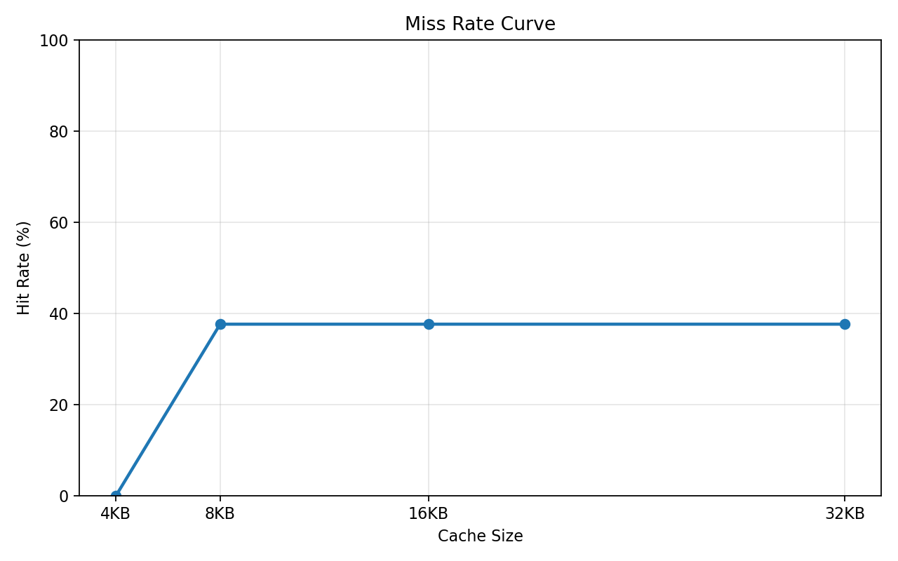
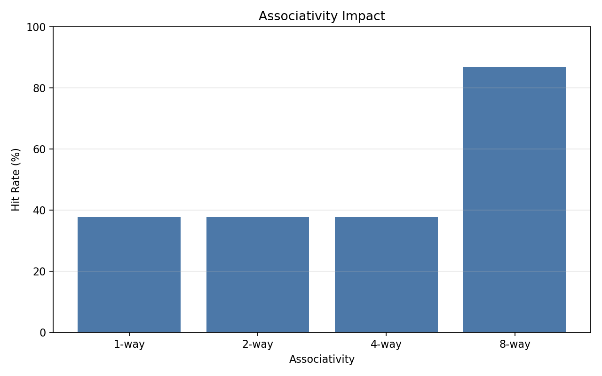

# Cache Simulator

A C++17 L1 cache simulator focused on performance modeling, CLI reproducibility, and algorithmic clarity. The simulator supports parameterized cache size, associativity, and block size, and uses strict LRU replacement with $O(1)$ average-time lookups and updates.

## Why This Repository Exists

This project is designed to demonstrate hardware-aware modeling, cache behavior analysis, and data-structure discipline. The implementation is intentionally explicit about the core tradeoff that matters in interview settings: the cache policy is not a linear scan over an array. It is a front-moved LRU list backed by a hash map.

## CLI

Build the simulator with:

```bash
make
```

Run it with a trace file and optional cache parameters:

```bash
./simulator <trace_file> [cache_size_bytes] [associativity] [block_size]
```

Examples:

```bash
./simulator traces/sample.trace
./simulator traces/sample.trace 32768 4 64
./simulator traces/sample.trace 16384 8 64
```

On Linux, the Makefile produces `simulator`, not `simulator.exe`.

Each trace line must contain an operation and a hexadecimal 32-bit address:

```text
R 0x1A2B3C4D
W 0xFFEEDDCC
```

`R` means read and `W` means write.

## Performance Model

The simulator derives its address fields from the runtime configuration:

- Number of sets = `cacheSize / (associativity * blockSize)`
- Block offset bits = `log2(blockSize)`
- Index bits = `log2(number of sets)`
- Tag bits = `32 - indexBits - offsetBits`

The cache is implemented with these rules:

- `std::list` stores the LRU order per set
- `std::unordered_map` maps tag values to list iterators
- On a hit, the entry moves to the front of the list
- On a miss, the new entry is inserted at the front
- On eviction, the least recently used entry at the back is removed

That gives $O(1)$ average-time lookup and update behavior.

## Build and Reproduce

```bash
make clean
make
./simulator traces/sample.trace
```

To regenerate the performance plots in `docs/`, run:

```bash
python3 docs/generate_plots.py
```

The script runs the same trace across multiple cache configurations and saves the outputs as PNG files for direct embedding.

## Performance Visuals

The plots below are generated from the repository's reproducible benchmark flow and are stored under `docs/`.

### Miss Rate Curve



### Associativity Impact



## Repository Layout

- `includes/cache.h` - cache interface and per-set LRU state
- `src/cache.cpp` - constructor, bit math, access path, and statistics
- `src/main.cpp` - CLI parsing and trace execution
- `docs/` - reproducibility script and PNG plots
- `traces/` - sample traces used for runs and demos

## Output

After processing a trace, the simulator reports:

- total accesses
- hits
- misses
- hit rate

## Notes

- Trace parsing ignores blank lines and malformed lines
- The simulator assumes 32-bit addresses
- The CLI validates that cache size, associativity, and block size are positive and divisible into a valid number of sets
